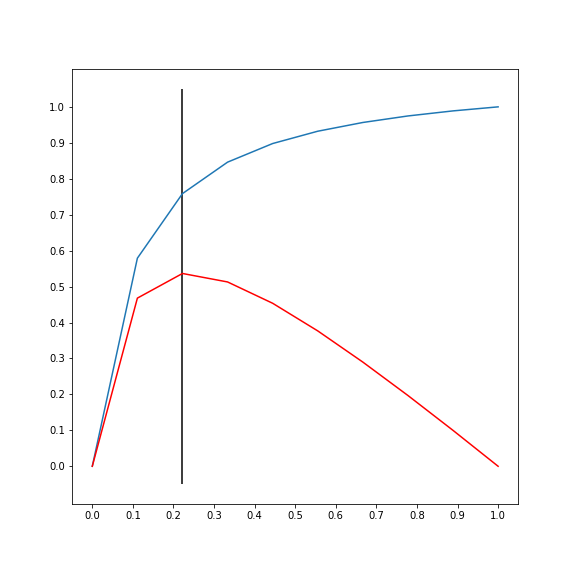
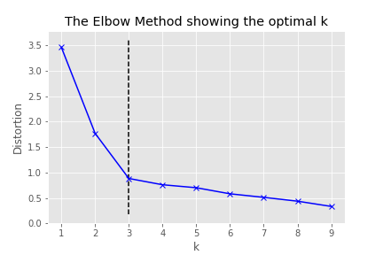

# kneed

## Knee-point detection in Python

[](https://mybinder.org/v2/gh/arvkevi/kneed/master)  [](https://travis-ci.com/arvkevi/kneed) [](https://www.codacy.com/app/arvkevi/kneed?utm_source=github.com&amp;utm_medium=referral&amp;utm_content=arvkevi/kneed&amp;utm_campaign=Badge_Grade)

This repository is an attempt to implement the kneedle algorithm, published [here](https://www1.icsi.berkeley.edu/~barath/papers/kneedle-simplex11.pdf). Given a set of `x` and `y` values, `kneed` will return the knee point of the function. The knee point is the point of maximum curvature.

## Installation

To install use pip:                                                                                                                                                                                                

     $ pip install kneed                                                                                                                                                                                            

Or clone the repo:                                                                                                                                                                                                 

     $ git clone https://github.com/arvkevi/kneed.git                                                                                                                                                               
     $ python setup.py install                                                                                                                                
**Tested with Python 3.5 and 3.6**

## Usage

#### Reproduce Figure 2 from the paper.

```python
from kneed import DataGenerator, KneeLocator

DG = DataGenerator()
x,y = DG.figure2()

print(x,y)
(array([ 0.        ,  0.11111111,  0.22222222,  0.33333333,  0.44444444,
         0.55555556,  0.66666667,  0.77777778,  0.88888889,  1.        ]),
 array([-5.        ,  0.26315789,  1.89655172,  2.69230769,  3.16326531,
         3.47457627,  3.69565217,  3.86075949,  3.98876404,  4.09090909]))

kneedle = KneeLocator(x, y, S=1.0, invert=False)

kneedle.knee
0.22222222222222221

kneedle.plot_knee_normalized()
```



#### Average Knee from 5000 NoisyGaussians when mu=50 and sigma=10

```python
import numpy as np

knees = []
for i in range(5000):
    x,y = DG.noisy_gaussian(mu=50, sigma=10, N=1000)
    kneedle = KneeLocator(x,y)
    knees.append(kneedle.knee)

np.mean(knees)
60.921051806064931
```

## Application

## Find the optimal number of clusters (k) to use in k-means clustering

See the tutorial in the notebooks folder, this can be achieved with the `direction` keyword argument:

```python
KneeLocator(x, y, direction='decreasing')
```



Contributing                                                                                                                                                                                                       

* * *

I welcome contibutions, if you have suggestions or would like to make improvements please submit an issue or pull request.                                                                                                                                                                                                                   

## Citation

Finding a “Kneedle” in a Haystack:
Detecting Knee Points in System Behavior
Ville Satopa
†
, Jeannie Albrecht†
, David Irwin‡
, and Barath Raghavan§
†Williams College, Williamstown, MA
‡University of Massachusetts Amherst, Amherst, MA
§
International Computer Science Institute, Berkeley, CA
