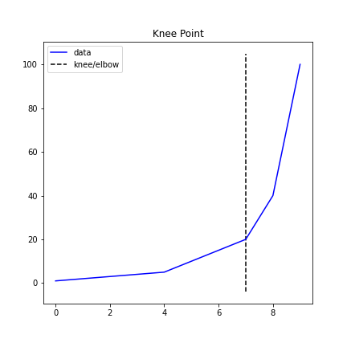
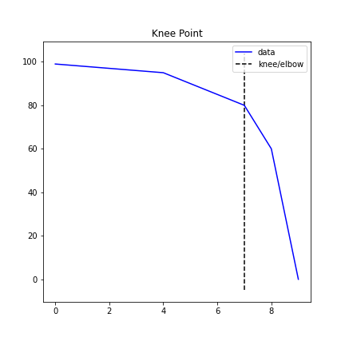
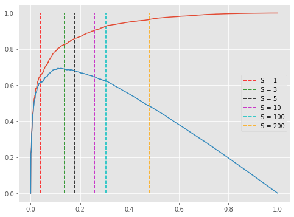
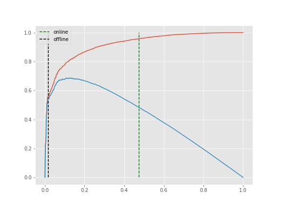
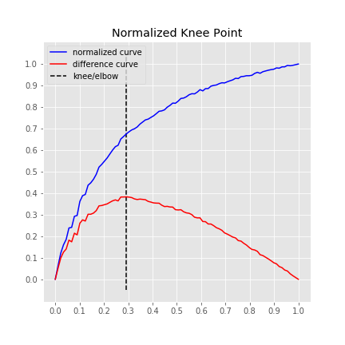
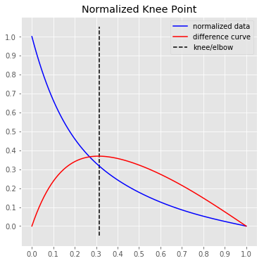
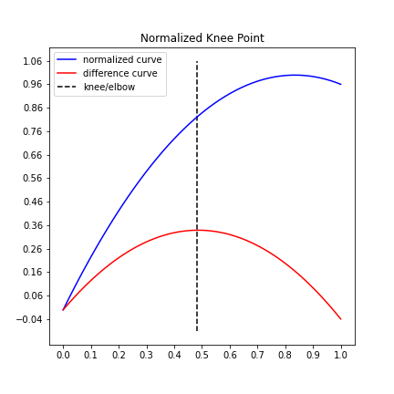

.. _parameters:

Parameter Examples
==================

This page provides examples that outline the effect of tuning the parameters
for the `KneeLocator` class.

curve
-----
If `curve="concave"`, kneed will detect knees. If `curve="convex"`, it will detect elbows. Use the `DataGenerator`
class to generate synthetic data:

An concave curve example:

.. code-block:: python

    from kneed import KneeLocator, DataGenerator as dg
    x, y = dg.concave_increasing()
    kl = KneeLocator(x, y, curve="concave")
    kl.plot_knee()

.. image:: ../images/concave.png

A convex curve example:

.. code-block:: python

    from kneed import KneeLocator, DataGenerator as dg
    x, y = dg.convex_increasing()
    kl = KneeLocator(x, y, curve="convex")
    kl.plot_knee()

direction
---------
The direction parameter describes the line from left to right on the x-axis. If the knee/elbow you are trying to
identify is on a positive slope use `direction="increasing"`, if the knee/elbow you are trying to identify is on a
negative slope, use `direction="decreasing"`. Use the `DataGenerator` class to generate synthetic data.

An example of an increasing curve:

.. code-block:: python

    from kneed import KneeLocator, DataGenerator as dg
    x, y = dg.concave_increasing()
    kl = KneeLocator(x, y, curve="concave", direction="increasing")
    kl.plot_knee()

.. image:: ../images/concave.png

An example of a decreasing curve:

.. code-block:: python

    from kneed import KneeLocator, DataGenerator as dg
    x, y = dg.concave_decreasing()
    kl = KneeLocator(x, y, curve="concave", direction="decreasing")
    kl.plot_knee()

S
-

The selected knee point is tunable by setting the sensitivity parameter `S`. From the manuscript:

> The sensitivity parameter allows us to adjust how aggressive we want Kneedle to be when detecting knees. Smaller values for S detect knees quicker, while larger values are more conservative. Put simply, S is a measure of how many “flat” points we expect to see in the unmodified data curve before declaring a knee.

.. code-block:: python

    import numpy as np

    np.random.seed(23)

    sensitivity = [1, 3, 5, 10, 100, 200, 400]
    knees = []
    norm_knees = []

    n = 1000
    x = range(1, n + 1)
    y = sorted(np.random.gamma(0.5, 1.0, n), reverse=True)
    for s in sensitivity:
        kl = KneeLocator(x, y, curve="convex", direction="decreasing", S=s)
        knees.append(kl.knee)
        norm_knees.append(kl.norm_knee)

    print(knees)
    [43, 137, 178, 258, 305, 482, 482]

    print([nk.round(2) for nk in norm_knees])
    [0.04, 0.14, 0.18, 0.26, 0.3, 0.48, 0.48]

    import matplotlib.pyplot as plt

    plt.style.use("ggplot")
    plt.figure(figsize=(8, 6))
    plt.plot(kl.x_normalized, kl.y_normalized)
    plt.plot(kl.x_difference, kl.y_difference)
    colors = ["r", "g", "k", "m", "c", "orange"]
    for k, c, s in zip(norm_knees, colors, sensitivity):
        plt.vlines(k, 0, 1, linestyles="--", colors=c, label=f"S = {s}")
    plt.legend()

Notice that any `S`>200 will result in a knee at 482 (0.48, normalized) in the plot above.

online
------

The knee point can be corrected if the parameter online is `True` (default). This mode will step through each element
in x.
In contrast, if online is False, kneed will run in offline mode and return the first knee point identified.
When `online=False` the first knee point identified is returned regardless of whether it's the local maxima on the
difference curve or the global maxima.
So the algorithm stops early. When `online=True`, kneed runs in online mode and "corrects" itself by continuing to
overwrite any previously identified knees.

Using the `x` and `y` from the sensitivity example above, this time, keep `S=1` but modify `online`.

.. code-block:: python

    kl_online = KneeLocator(x, y, curve="convex", direction="decreasing", online=True)
    kl_offline = KneeLocator(x, y, curve="convex", direction="decreasing", online=False)

    import matplotlib.pyplot as plt

    plt.style.use("ggplot")
    plt.figure(figsize=(8, 6))
    plt.plot(kl_online.x_normalized, kl_online.y_normalized)
    plt.plot(kl_online.x_difference, kl_online.y_difference)
    colors = ["r", "g"]
    for k, c, o in zip(
        [kl_online.norm_knee, kl_offline.norm_knee], ["r", "g"], ["online", "offline"]
    ):
        plt.vlines(k, 0, 1, linestyles="--", colors=c, label=o)
    plt.legend()

interp_method
-------------

This parameter controls the interpolation method for fitting a spline to the input `x` and `y` data points.
Valid arguments are `"interp1d"` and `"polynomial"`.

If `interp_method="interp1d"`, then `x` and `y` will be fit using
`scipy.interpolate.interp1d <https://docs.scipy.org/doc/scipy/reference/generated/scipy.interpolate.interp1d.html>`__.

.. code-block:: python

    x = list(range(90))
    y = [
        7304, 6978, 6666, 6463, 6326, 6048, 6032, 5762, 5742,
        5398, 5256, 5226, 5001, 4941, 4854, 4734, 4558, 4491,
        4411, 4333, 4234, 4139, 4056, 4022, 3867, 3808, 3745,
        3692, 3645, 3618, 3574, 3504, 3452, 3401, 3382, 3340,
        3301, 3247, 3190, 3179, 3154, 3089, 3045, 2988, 2993,
        2941, 2875, 2866, 2834, 2785, 2759, 2763, 2720, 2660,
        2690, 2635, 2632, 2574, 2555, 2545, 2513, 2491, 2496,
        2466, 2442, 2420, 2381, 2388, 2340, 2335, 2318, 2319,
        2308, 2262, 2235, 2259, 2221, 2202, 2184, 2170, 2160,
        2127, 2134, 2101, 2101, 2066, 2074, 2063, 2048, 2031
    ]

    kneedle = KneeLocator(
        x, y, S=1.0, curve="convex", direction="decreasing", interp_method="interp1d"
    )
    kneedle.plot_knee_normalized()

If `interp_method="polynomial"`, then `x` and `y` will be fit using
`numpy.polyfit <https://numpy.org/doc/stable/reference/generated/numpy.polyfit.html>`__. Using the same data, change
`interp_method` and note that the line is smoother.

.. code-block:: python

    kneedle = KneeLocator(
        x, y, S=1.0, curve="convex", direction="decreasing", interp_method="polynomial",
    )
    kneedle.plot_knee_normalized()

polynomial_degree
-----------------

This parameter controls the degree of the polynomial fit. This parameter is passed as the argument to the `deg`
parameter in `numpy.polyfit <https://numpy.org/doc/stable/reference/generated/numpy.polyfit.html>`__.

Using the same data from the `interp_method` example, note how the line (and knee point) change when
`polynomial_degree=2` instead of the default value, `7`:

.. code-block:: python

    kneedle = KneeLocator(
        x, y, S=1.0, curve="convex", direction="decreasing", interp_method="polynomial",
        polynomial_degree=2
    )
    kneedle.plot_knee_normalized()

