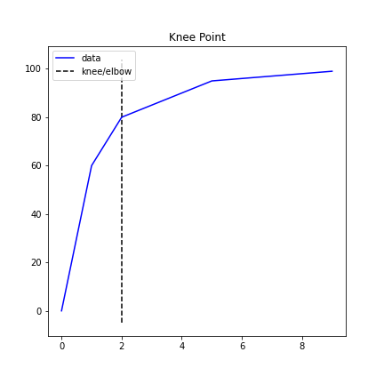
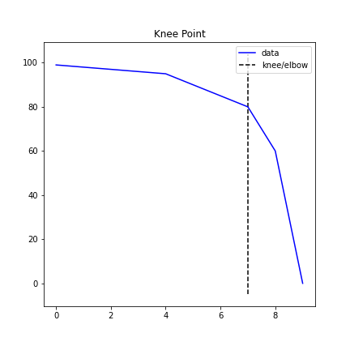
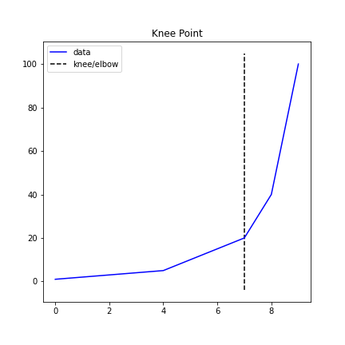

# Curve Types

Understanding the `curve` and `direction` parameters is essential for correct knee/elbow detection. This guide shows all four combinations with visual examples.

## The Four Combinations

`KneeLocator` supports four combinations of `curve` and `direction`:

| Curve     | Direction    | Use Case                              | Example                    |
|-----------|-------------|---------------------------------------|----------------------------|
| concave   | increasing  | Diminishing returns curve             | K-means inertia vs. k      |
| concave   | decreasing  | Accelerating decline                  | Model accuracy vs. pruning  |
| convex    | increasing  | Accelerating growth                   | Exponential-like curves     |
| convex    | decreasing  | Diminishing decline (elbow)           | Sorted eigenvalues          |

## Concave Increasing

The most common case. The curve rises steeply at first, then levels off. The knee is where the curve transitions from steep to flat.

```python
from kneed import KneeLocator, DataGenerator as dg

x, y = dg.concave_increasing()
kl = KneeLocator(x, y, curve="concave", direction="increasing")
kl.plot_knee()
print(f"Knee at x={kl.knee}")
```



## Concave Decreasing

The curve starts flat and then drops steeply. The knee is where the decline accelerates.

```python
x, y = dg.concave_decreasing()
kl = KneeLocator(x, y, curve="concave", direction="decreasing")
kl.plot_knee()
print(f"Knee at x={kl.knee}")
```



## Convex Increasing

The curve starts flat and then rises steeply. The elbow is where the growth accelerates.

```python
x, y = dg.convex_increasing()
kl = KneeLocator(x, y, curve="convex", direction="increasing")
kl.plot_knee()
print(f"Elbow at x={kl.elbow}")
```



## Convex Decreasing

The curve drops steeply at first, then levels off. The elbow is where the decline slows. This is the classic "elbow method" shape (e.g., sorted eigenvalues, decreasing loss).

```python
x, y = dg.convex_decreasing()
kl = KneeLocator(x, y, curve="convex", direction="decreasing")
kl.plot_knee()
print(f"Elbow at x={kl.elbow}")
```

## How to Choose

!!! tip "Not sure which to use?"
    Use [`find_shape()`](find-shape.md) to auto-detect:

    ```python
    from kneed import find_shape

    direction, curve = find_shape(x, y)
    print(f"Detected: direction={direction}, curve={curve}")
    ```

### Rules of Thumb

- **Concave vs. Convex**: If your curve bends like a bowl opening upward, it's **concave**. If it bends like a bowl opening downward, it's **convex**.
- **Increasing vs. Decreasing**: Look at the overall trend from left to right. If values go up, it's **increasing**. If they go down, it's **decreasing**.
- **Knee vs. Elbow**: The terms "knee" and "elbow" are interchangeable in `kneed`. Both `kl.knee` and `kl.elbow` return the same value.
